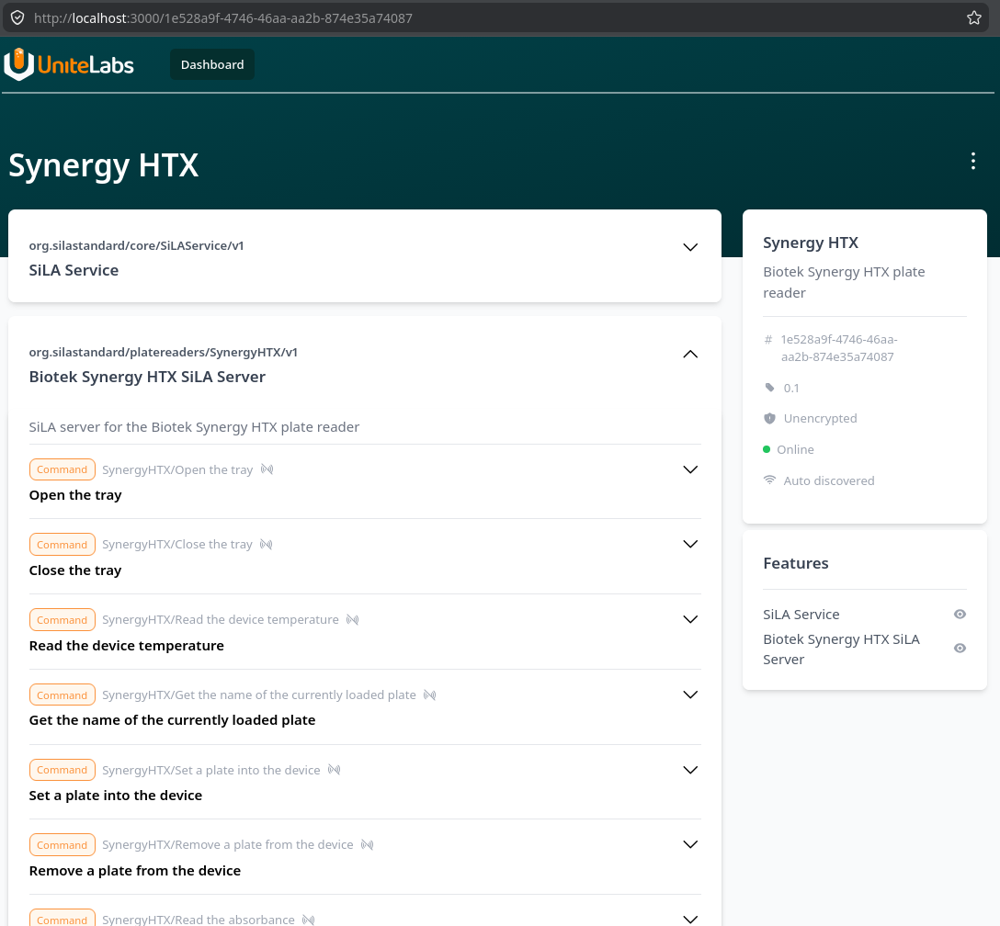

# Overview

The VU Lab uses a BioTek Synergy HTX plate reader capable of reading the temperature, fluorescence, absorbance and luminescence of samples.

The proprietary [BioTek Gen5](https://www.agilent.com/en/product/microplate-instrumentation/microplate-instrumentation-control-analysis-software/imager-reader-control-analysis-software/biotek-gen5-software-for-detection-1623227) software runs only on Windows and allows very limited communication with the device via third-party tools.

The current setup uses the open-source PyLabRobot framework to communicate with the Synergy HTX plate reader via a reverse-engineered communication protocol. The VU Lab suite includes a [SynergyHTX class](#) that acts as a controller implementing methods for the following functionalities:

- Read the firmware ID
- Open and close the tray
- Set and remove a plate
- Read the absorbance, the fluorescence and the luminescence

They are also implemented by a [SiLA server](#) that acts as an interface between the scheduler and the plate reader.

# Setup

Currently, the PyLabRobot framework supports communicating with the Synergy HTX via the [`BioTekPlateReaderBackend` backend](https://github.com/PyLabRobot/pylabrobot/blob/main/pylabrobot/plate_reading/agilent/biotek_backend.py). While some of the functionality is supported out of the box, please refer to the [outstanding issues](#outstanding-issues) for a list of functions that are still not working.

## Linux
If you have installed the `openlab_vu` package, you don't need any special setup.

## Windows
To use PyLabRobot under Windows, you need to set up WSL (you only have to do this once):

### WSL

1. Install WSL if it's not installed already.
2. Add the user to the `plugdev` group with `gpasswd -a <your-user-name> plugdev`.
3. Add the following rule to `/etc/udev/rules.d/10-wsl-usb.rules`:
    ```sh
    SUBSYSTEM=="usb", ATTRS{idVendor}=="<usb-vendor-id>", ATTRS{idProduct}=="<usb-product-id>", MODE="0666"
    ```
4. Restart WSL for these changes to take effect.

### USB

Once WSL is set up, you have to expose the USB subsystem to WSL (Windows doesn't do that automatically):

1. Install the [USBIPD-WIN](https://github.com/dorssel/usbipd-win) package (also see the Microsoft guide [here](https://learn.microsoft.com/en-us/windows/wsl/connect-usb)).
2. Connect the USB device (if you haven't already) and list all devices with `usbipd`:

```sh
usbipd list
```
Make sure that the device shows up in the list. If it doesn't, turning it on and off usually solves the issue. Also, make sure that nothing else is trying to access it (such as the Gen5 software).

3. When you find the device, take note of the bus ID (it will be something like `3-9`), which is necessary to expose the device to WSL with the following command:

```sh
usbipd attach -a -w -u -b=<BUSID>
```

Replace <BUSID> with the bus ID that you discovered in the previous step. After this, your device should be visible to Linux, which you can check with `lsusb`:

```sh
lsusb
```

You should be able to see the device with the same bus ID as the one reported by `usbipd`.

### SiLA server

By now everything should be set up to start the SiLA server for the plate reader. Navigate to the `src/openlab_vu/platereader` directory and launch the server with the following command:

```sh
python -m synergy_htx --insecure -p 50000
```

If all goes well, you should see some printed output from SiLA:

```sh
2026-07-01 11:17:44,117:WARNING:sila2.server.sila_server:Starting SiLA server without encryption
2026-07-01 11:17:45,786:INFO:__main__:Server startup complete
```

You can now explore the SiLA server with the SiLA browser:

.

# Standalone backend

The SynergyHTX backend can be used as a regular Python library, without SiLA. You can import the backend and instantiate it:

```python
from openlab_vu.platereader.controller.synergy import SynergyHTXController
controller = SynergyHTXController()
```

The SiLA server uses the controller in this way to communicate with the device.

# Usage

The controller currently supports the following functions:

- Reading the serial number
- Reading the temperature
- Opening and closing the tray
- Setting and removing a plate

You can test those via the SiLA browser (see above). While the `BioTekPlateReaderBackend` class provides methods for reading the absorbance, fluorescence and luminescence, the SynergyHTX device is not currently supported out of the box due to slight differences the communication protocol. Once all the functionality is working, a new backend for the Synergy HTX device can be added to PLR. See the [PLR documentation](https://docs.pylabrobot.org/stable/contributor_guide/new-machine-type.html) for more information on how to contribute.
