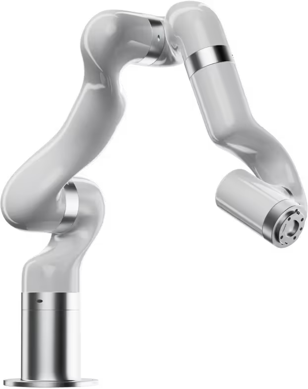

# Robot Arm
{width=400 align=right}
**Hardware:** [UFactory 850](https://www.ufactory.us/product/850) — an xArm variant

**SiLA server source:** [genericroboticarm](https://gitlab.com/OpenLabAutomation/device-integration/genericroboticarm)

**Docker service:** `robot_arm` (port 50054)

---

## Hardware setup

The UFactory 850 is a 6-DOF collaborative robot arm used to move microtiter plates between positions on the platform (shakers, hotel, scanner, plate reader). It connects to the lab PC over Ethernet.

**Default IP address:** `192.168.1.202`

---

## Running the SiLA server

The robot arm runs as a Docker service. Start it with:

```bash
docker compose up robot-arm
```

To connect to the real arm, set `ROBOT_IP` in a `.env` file in the project root:

```env
ROBOT_IP=192.168.1.202
```

If `ROBOT_IP` is unset, the server starts in simulation mode — all move commands are accepted but nothing physically happens.

A web interface for the arm is available at [http://localhost:8055](http://localhost:8055) when the service is running.

---

## Configuration

| Environment variable | Default | Description |
|---|---|---|
| `PORT` | `50054` | SiLA2 server port |
| `HOST` | `0.0.0.0` | Bind address |
| `ROBOT_IP` | *(unset)* | IP address of the physical arm. If unset, runs in simulation mode. |
| `ROBOT_ARGS` | *(empty)* | Extra flags passed to the server entrypoint |

---

## VU-lab customization

The `genericroboticarm` package provides a generic `XArmImplementation`. The VU-lab subclasses it in `src/openlab_vu/robot_arm/vu_lab/xarm_impl.py`:

```python
class VULabArm(XArmImplementation):
    @classmethod
    def get_name(cls) -> str:
        return "VULabArm"

    def site_to_position_identifier(self, device: str, slot: int) -> str:
        if slot > 0:
            return f"{device}_{slot}"
        else:
            return device
```

- `get_name()` sets the SiLA server name to `"VULabArm"` — this must match the value in `sila_server_name` in `worker_adaption.py`.
- `site_to_position_identifier()` maps a `(device, slot)` pair to a node label in the position graph. Single-slot devices use just the device name (e.g. `shaker_1_d_pos_1`); multi-slot devices append the slot number (e.g. `hotel_1_d_pos_3`).

---

## Position graph

The arm's reachable positions are defined in `src/openlab_vu/robot_arm/new_graphs/position_graph_VULabArm.gml`. This file is mounted into the container at runtime. Each node in the graph corresponds to a named position on the platform; edges define valid move paths between them.

See [Lab Configuration — Position graph](../lab-configuration.md#position-graph) for details on the graph format and how to add new positions.