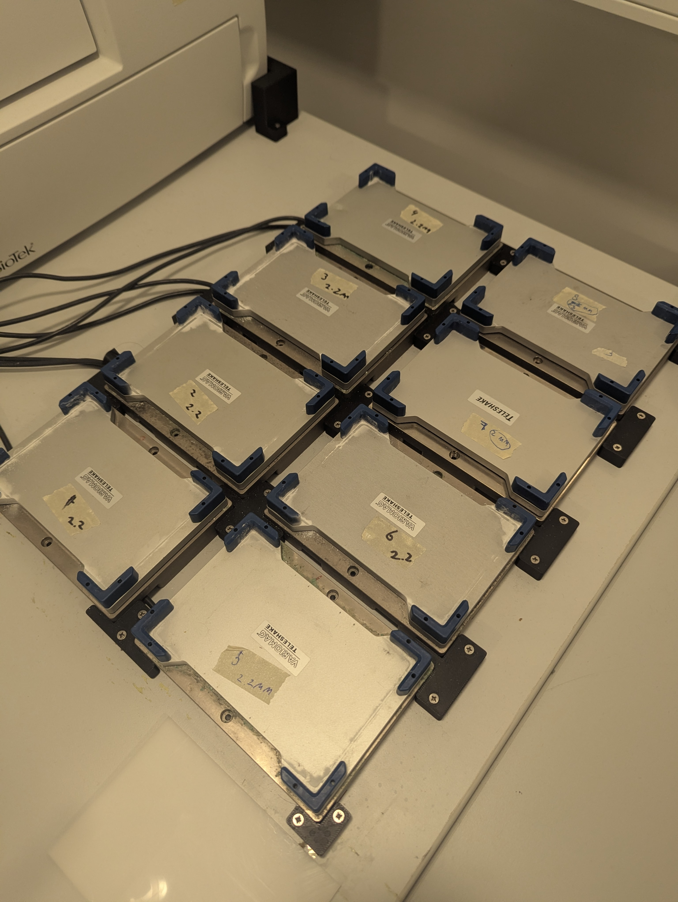
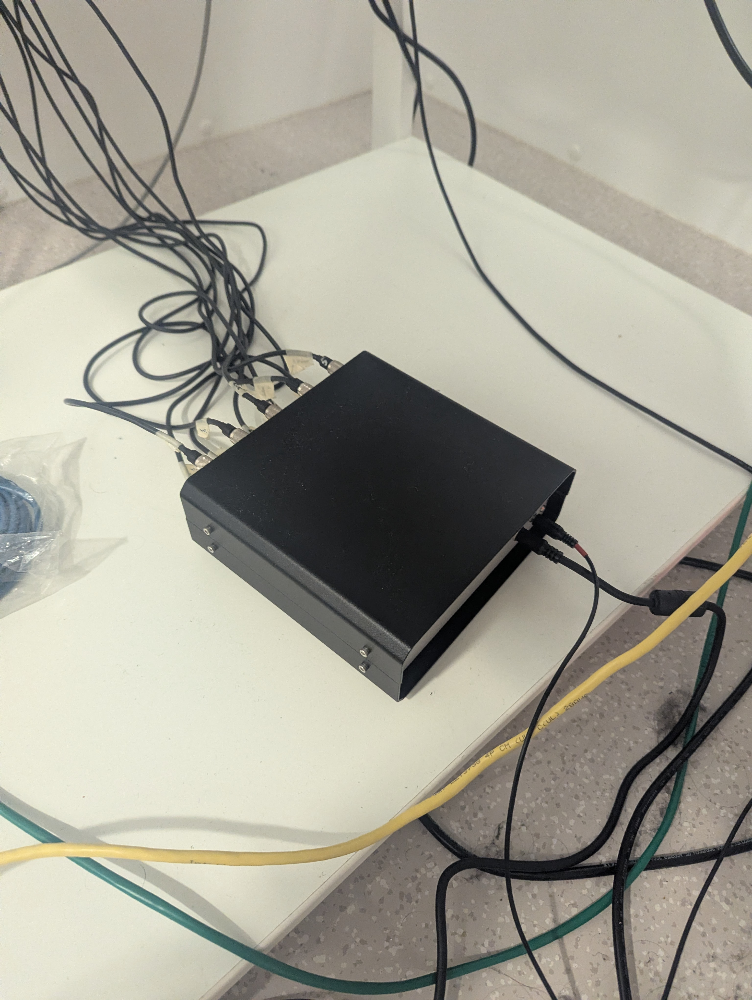

# Teleshake 1536

**Hardware:** VARIONMAG Teleshake 1536 magnetic shakers (8 units), controlled via a custom multi-shaker hub

**SiLA server source:** [Teleshake-1536](https://github.com/OSLA-project/Teleshake-1536)

**Running mode:** Native on Windows (not in Docker — see below)

---

## Hardware setup

The lab has 8 VARIONMAG Teleshake 1536 shakers mounted in a fixed rack. All shakers connect via individual control line cables to a custom black metal hub box, which acts as a combined controller and multiplexer. The hub has a single RS-232 connection to the PC (COM1, native serial port — not USB).

{ width=400, style="display:block;margin:auto" }
{ width=400, style="display:block;margin:auto" }

The shakers are addressed individually via the RS-232 protocol using address bytes 1–8 corresponding to each shaker's physical port on the hub. Note that this is **not** a daisy-chain setup — all shakers plug directly into the hub, which handles the routing.

**Important:** RS-232 remote control only works when the frequency selection knob on each SHAKEMODUL control unit is set to **OFF**. When the knob is in any other position, the shaker operates in manual mode and ignores all RS-232 commands (`poti_off=False` in the status byte).

---

## Running the SiLA server

The teleshake SiLA server cannot run inside Docker on Windows because true RS-232 COM ports cannot be passed through to Linux containers (only USB devices can be forwarded via usbipd-win). Run it natively on Windows instead:

```powershell
uv run python -m sila2_driver.thermoscientific.teleshake1536 --port 50050 --debug --insecure --server-uuid "da160a69-7d50-4d63-8a75-f90815755745"
```

To log output to a file:

```powershell
uv run python -m sila2_driver.thermoscientific.teleshake1536 --port 50050 --debug --insecure --server-uuid "da160a69-7d50-4d63-8a75-f90815755745" 2>&1 | Tee-Object -FilePath log.txt
```

After starting, use the SiLA browser at [http://localhost:3000](http://localhost:3000) to configure the serial port:

1. Open **SettingsService → SetSerialPort**
2. Set the port name to `COM1`

---

## Serial port configuration

| Setting | Value |
|---|---|
| Port | `COM1` (native RS-232, ACPI\PNP0501) |
| Baud rate | 9600 |
| Parity | None |
| Stop bits | 1 |

Note: `COM3` is an unrelated FTDI USB-to-serial adapter on this PC — do not use it for the shakers.

---

## Known issues and troubleshooting

### Permission denied on COM port

If the SiLA server reports `PermissionError: could not open port 'COMx': Access is denied`, another process has the port open. Kill all lingering Python processes:

```powershell
Get-Process python | Stop-Process -Force
```

Then restart the SiLA server and set the serial port again via the SiLA browser.

### Timeout errors / no reply

If all commands time out with no reply from the shaker:

- **Check hub power** — the hub has an external power supply that must be plugged in firmly. When hub power is lost and restored, the shakers may take a moment to reinitialise.
- **Check COM port** — after a USB replug or reboot, the port number may change. Run `python -c "import serial.tools.list_ports; print([p.device for p in serial.tools.list_ports.comports()])"` to list available ports.
- **Check shaker power** — shakers must be powered on to respond.

### Shaker does not start (`ERR_NO_ERROR_RECORDED` or `Not started`)

This usually means one of:

- **`poti_off=False`** — the frequency selection knob on the SHAKEMODUL control unit is not at the OFF position. The shaker will silently ignore RS-232 motor commands. Turn the knob to OFF.
- **`address_set=False`** — the shaker has not been assigned an address. Use ShakerId 1–8 (not 0) corresponding to the physical port on the hub. Address 0 may work for some status queries but not for motor commands.
- **Clamp not closed** — call `LockPlate` before `StartShaking`. The driver sends `CloseClamp` followed by a 2-second wait; do not skip this step.

Use the `GetStatus` SiLA command to inspect the full status byte before diagnosing:

```
StatusByte(accel, on, err, poti_off, debug, address_set, prog, clamp_closed)
```

### Shaker model identification

The shakers are branded **VARIONMAG Teleshake** (H+P Labortechnik, predecessor to Thermo Scientific). The serial protocol used by the driver is compatible with these units. If you encounter unexpected protocol errors, verify that the baud rate and command codes match the hardware generation installed.

---

## Diagnostic script

A serial port diagnostic script is included at `src/openlab_vu/teleshake/diagnose_serial.py`. It sends a `GetInfo` frame at all common baud rates and reports which one gets a reply:

```powershell
python src/openlab_vu/teleshake/diagnose_serial.py
```

Use this when you are unsure whether the PC can communicate with the hub at all.
