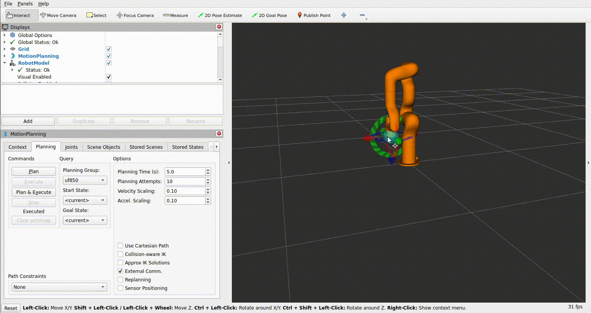

# Robotic arm controller

The [Ufactory 850](https://www.ufactory.cc/ufactory-850/) robotic arm used in the VU Lab has the following features:

1. Six DOF, 5 kg payload, 850 mm reach.
2. [Python](https://github.com/xArm-Developer/xArm-Python-SDK) and [C++](https://github.com/xArm-Developer/xArm-CPLUS-SDK) SDK and [ROS2](https://github.com/xArm-Developer/xarm_ros2) packages.

The ROS2 packages are built upon the xArm C++ SDK (cf. above), which is added as a submodule. The arm can be controlled either directly with the or using the `xarm_controller` package or via the [MoveIt2 library](https://moveit.picknik.ai/humble/index.html). MoveIt itself also supports C++ and Python for interfacing with the hardware.

Motion planning is handled using the [OMPL](https://ompl.kavrakilab.org/) library, which enables the arm to be operated by specifying the final pose of the arm.

## Dockerfile

NOTE: This workflow has been tested with `podman`. If you are using `docker`, please replace all instances of '`podman`' in the instructions below with '`docker`' (it shouldn't be necessary to modify anything else).

### Build

```sh
podman build --rm -t xarm --build-arg=USER=$USER ./
```

This step does the following:

1. Sets up an Ubuntu image with all necessary libraries (ROS2, MoveIt, OMPL...).
2. Sets up the user to match the current user so that local directories can be mounted without changing permissions.
3. Clones and compiles the xArm ROS2 packages.
4. Updates `.bashrc` in the user's home directory so that we don't have to `source` the ROS environments manually.

### Run

If you are on Linux, first you need to allow `podman` to access your display:

```sh
xhost +local:podman
```

Or respectively for `docker`:

```sh
xhost +local:docker
```

To spawn a shell inside the container, run:

```sh
podman run -e DISPLAY --device /dev/dri --net=host -v /tmp/.X11-unix:/tmp/.X11-unix:rw -ti xarm /bin/bash
```

<span style="color: #ff0000;">NOTE</span>: Mounting the `controller` is necessary to be able to seamlessly share files between the host and the container. By default, both `podman` and `docker` change the permissions of mounted volumes so that they become inaccessbile on the host. This is mitigated by the above command (combined with some logic in the `Dockerfile`). However, the first time you run this, it will take a rather long time, although subsequent runs will be fast. We are currently investigating why this is happening.

To mount the `controller` directory as a volume at runtime:

```sh
podman run -e DISPLAY --device /dev/dri --net=host -v `pwd`/controller:/home/$USER/controller -v /tmp/.X11-unix:/tmp/.X11-unix:rw --userns=keep-id -ti xarm /bin/bash
```

If everything goes smoothly, `podman` (or `docker`) should now have access to the display of the host so that you can run GUI programs. You can now fire up the simulated xArm in RViz from inside the container:

```sh
ros2 launch xarm_moveit_config uf850_moveit_fake.launch.py [add_gripper:=true]
```

You should be able to manipulate the simulated arm manually, as follows:



## Next steps

- [ ] :construction: Controlling the arm with ROS2 + MoveIt by calling a ROSs service.
- [ ] Same for gripping.
- [ ] Encapsulating this feature into a SILA connector implementation.
- [ ] Migrate the build & run steps to the main `docker-compose.yml`.
